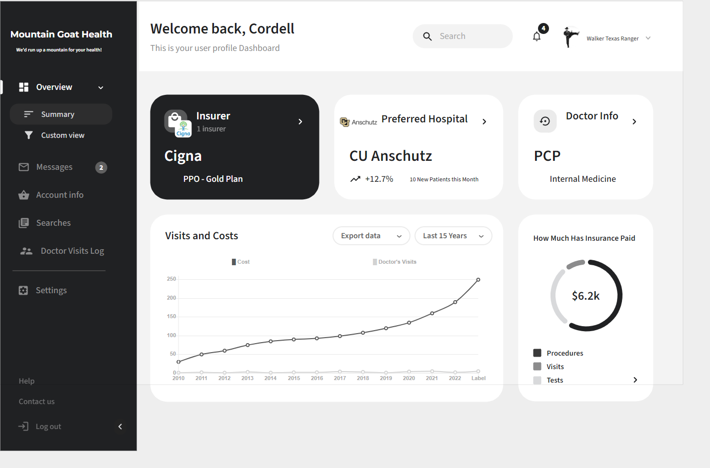

Nicolas Mavromatis, Nima6629

Cooper Ide, coid6456

Patrick Chesnut, chesnutp

Project Milestone 4: Web Pages Design

For each page, include:

Page Title
Page Description (include a mockup or hand drawn image of the page)
Parameters needed for the page
Data needed to render the page
Link destinations for the page
List of tests for verifying the rendering of the page

Page 1: Welcome Page (Home)
This page displays a welcome message, and is the central page that links to all others. 
It will have text explaining the app, such as "Search Medical Procedure Prices Before You Pay For Care".
Below this will be a search bar to search by procedure name or code.
The search bar will need to store the search string as a parameter, which then links to the proper dynamically generated results page.
This will work by dynamically executing a SQL search on the database then generating a page with results. 
The page will need to access the Database data in real time to generate the results. 
There will also need to be a "No results found page", which can be a simple string displaying intended search and a back link to return to the Welcome page.
On the top of page will be links to login, browse by procedure, browse by insurer, browse by hospital, and the user profile page.
There will be tests to verify all the links work. 
There will also be tests to verify a non-existent test search links to the not found page.
Finally, there should be tests that a few test code/procedure results generate correct SQL results that are rendered correctly in the results page.
Scrolling may need to be tested if results don't fit on a single page. 

<figure>
  
</figure>
    
Page 2: Login Page
This page displays a username and password box to login. 
It will need to store the username and password as string parameters.
It will need access to a file that checks if the username and password are correct.
If it is not correct, it should open a "not found" page.
If it is correct, it should link to a "Welcome user" page simply displaying text, or it could link to the user profile page.
There will also be a link to return to the welcome page if the user does not want to enter in a login.
There will need to be tests that a non-existent username or password links to the not found page and it renders.
We will create a sample login, and test that the user can login, and that it opens the correct result page that renders.
We still need to decide if a successful login links to the user profile page, or somewhere else. 

<figure>
  
</figure>

    
Page 5: User Info Page
This page displays the users account information. 
It will need to store an active session token and it will need the user's username as string parameters.
It will need access to user information and their configuration info.
If active session is idle for too long, it should log the user out and redirect to the login page.
If for some reason the user is not found or the token is corrupted it should log the user out and display a "not found" page.
If user is found and session is active, it should link to a "User Info" page that will display their account settings and other configs.
There is a lot of data on this page so we will need to make sure it correctly maps to our backend.
We will need to create a few new tables for tracking visits and costs
There will need to be tests that can verify the correct images render based on the user's info.
There will need to be tests to make sure a non-existent user renders a not found page.
There will need to be tests to make sure a user account does not render in the case of a corrupted or inactive token.
We will create a sample login, and test that the user can navigate to their user info page, and that it opens the correct user info page and that it renders.

<figure>
  
</figure>
    
Page 6: Browse By Hospital Page
This page displays the procedures and costs of a given hospital. 
We will need the hospitals name as a string parameter.
For the return data we will need a query with the id of the hospital passed in to return the results of our main table.
If for the hospital does not exist it will not show in the autocomplete suggestion.
All links on the page should correctly route to the correct pages, this should be consistent across all pages.
There will need to be tests to verify that the autcomplete is functioning as it should and that it is providing correct suggestions.
There will need to be tests to make sure the data returned from the query is compatible with the table we are rendering.
We will also need to verify the text box with the Hospital name matches the id in the returned query.

<figure>
  
</figure>

