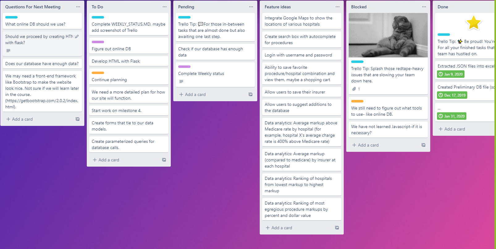

# Team 5 - Mountain Goats
## Weekly Status Report for Medical Procedure Price Checker
#### Members
- Nicolas Mavromatis (Nima6629)
- Cooper Ide (coid6456)
- Patrick Chesnut (chesnutp)
---
#### Week 6 Update (26 Sept to 2 Oct)
    
During our first week, we collected JSON and csv files of medical prices for several hospitals, Medicare, and Medicaid.  We also gathered CPT code descriptions so we know what procedure each billing code represents.  Data from the JSON and csv files was extracted with python scripts into an excel file.  Each sheet in the Excel file will represent a different table in a SQL database.  A data dictionary was also created to describe the data.

During the second week, we wrote a python script that created a sqlite database file. We made a first iteration of placing tasks on Trello.  We also started to brainstorm what features the app should have and the major web pages.

Plans for next week include continuing to learn Flask, the basics of SQL, and working early on milestone 4 to develop web page structure. We feel we are in an early stage and still learning many new tools so progress is slow. 

Our top priorities are to learn Flask and plan our web layout.
We plan to make a mockup of pages, and create a list of page descriptions after organizing the structure of the application. 

During our third week, we continued to learn Flask, and started on the web layout design. 
We plan to think about implementation details for python scripts for passing parameters to the database engine.

During the fourth week, we finalized the web page layout design. We also started thinking about the SQL design for milestone 5. 
We decided on what happens when a user logs in. After a successful login, it should return to the welcome page. 

<figure>
  
</figure>

---